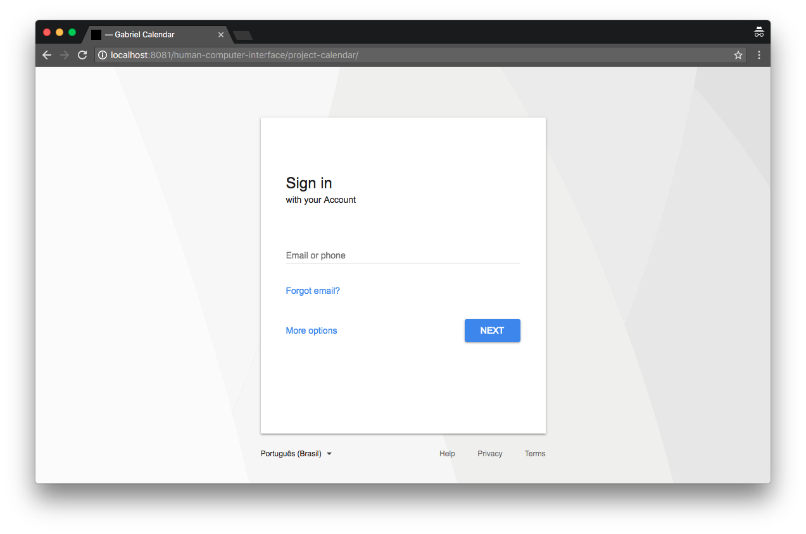

> RS-20181-FSPOA-IHC-PRE-ADS3N18-1: Interface Homem Computador (ADS3N18-1)

### Projeto IHC

# iTask

**iTask**

Básica é uma plataforma gerenciadora de tarefas, onde vocês vai pode 
criar tarefas a serem realizadas por você ou sua equipe.

#### Cores

Optei por usar branco nas minha telas pelo fato de ser uma cor neutra, adaptativa a maioria das demais cores.

> Obs: Sitar Google, Apple, Amazon, Walmart, Facebook e demais site q usem branco como cor principal.

**Referências**

+ Apple
Quando eu estava criando o **iTask** uma das minhas grandes referências foram as telas de produtos em gerais da Apple pelo fato de serem clean, mas o que eu quero dizer com isso, o que as telas/layout da Apple tem em comum são a beleza em poucas coisas, telas limpas intuitivas e que entrega pro usuário apenas o necessário, nada maçante ou extravagante.

#### Telas

vini.prettodasilva@gmail.com